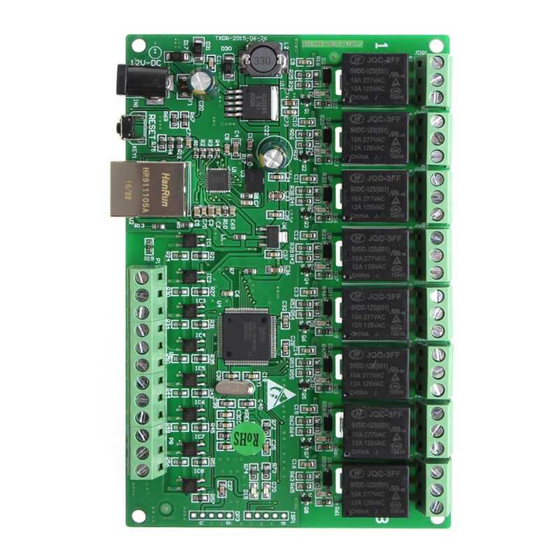

# ali_ip_relay

This integration shows how you would go ahead and integrate a physical light into Home Assistant.




[Buy in Aliexpress](https://aliexpress.ru/item/32914881766.html)

### Installation

Copy this folder to `<config_dir>/custom_components/ali_ip_relay/`.

Add the following entry in your `configuration.yaml`:

```yaml
light:
  - platform: ali_ip_relay
    ip: IP_HERE
    port: PORT_HERE
```
